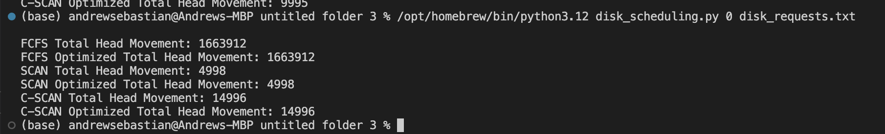
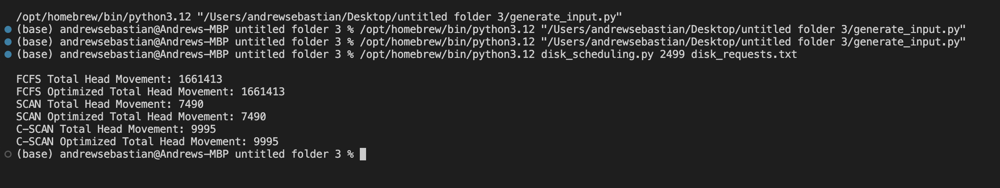
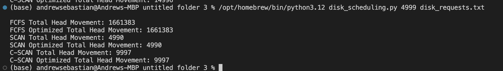

# Disk Scheduling Algorithms Visualization (Operating System Assignment 2)

## Overview
This project implements three different disk scheduling algorithms:
1. FCFS (First Come, First Served)
2. SCAN (Elevator Algorithm)
3. C-SCAN (Circular SCAN)

The algorithms are used to handle a sequence of disk cylinder access requests, with the goal to minimize the head movements of a hard-drive disk that has 5,000 cylinders numbered from 0 to 4999.

## How to Run the Scripts
Ensure that Python is installed on your system. This project uses Python to simulate disk scheduling algorithms and requires a text file `disk_requests.txt` containing 1,000 random cylinder requests.

To run the script, use the following command in your terminal:

`/opt/homebrew/bin/python3.12 disk_scheduling.py <initial_pos> disk_requests.txt`

## Results
The results show the total head movements for each algorithm starting from different initial positions. Below are the visualizations of the results:

### Starting Position at Cylinder 0

### Starting Position at Cylinder 2499

### Starting Position at Cylinder 4999

